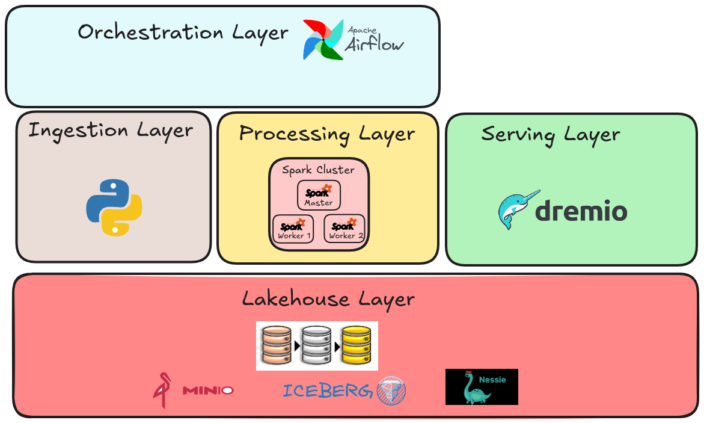
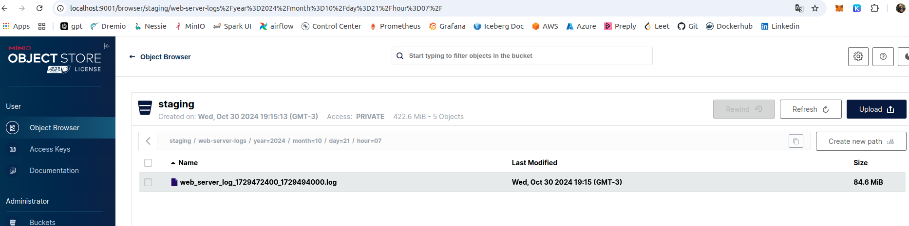
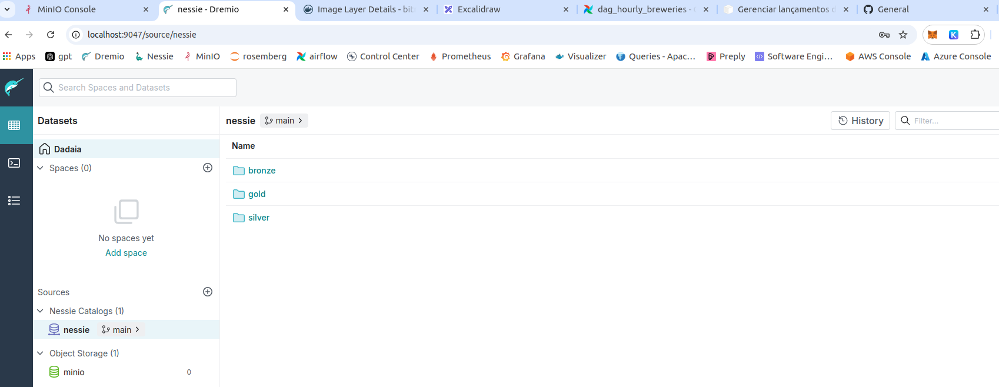
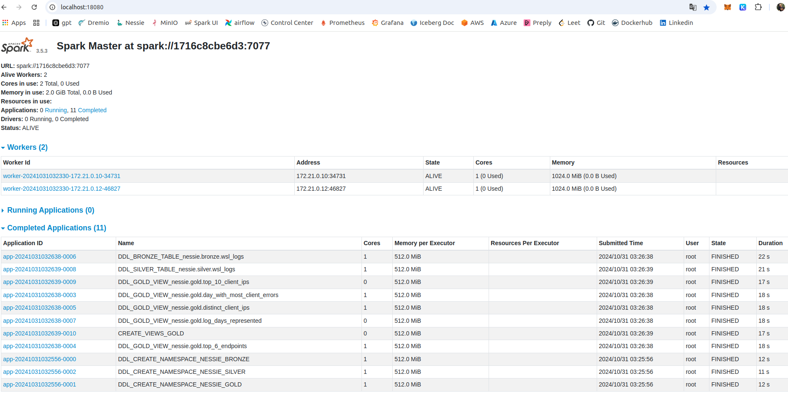
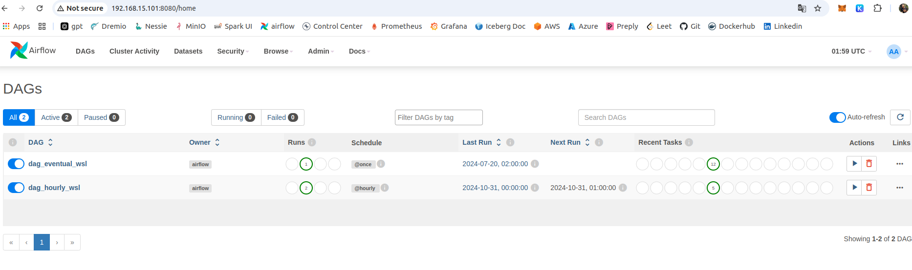

## 2. Arquitetura técnica e serviços

Para construção da solução uma plataforma de dados com diferentes serviços precisa ser construída. Cada serviço desempenha um papel específico. O intuito dessa seção é apresentar tais serviços, características e casos de uso, bem como a forma com que eles se relacionam.

- A ferramenta **docker** foi usada para instanciar todos os serviços necessários localmente na forma de containers. 
- Na pasta `/services` estão definidos **arquivos yml** nos quais os serviços estão declarados.
- Os arquivos yml são usados para instanciar os serviços usando o **docker-compose**.
- É também possível instanciar os containers em diferentes máquinas usando o **docker swarm**.
- Para automatizar o deploy dos serviços, foi criado um **Makefile** com comandos para build, deploy e remoção dos serviços. Mais detalhes na seção 6.


**Observação**: A arquitetura de serviços reproduzida tem como referência projetos pessoais desenvolvidos nos seguintes repositórios:
- https://github.com/marcoaureliomenezes/ice-lakehouse
- https://github.com/marcoaureliomenezes/dd_chain_explorer


### 2.1. Camada Lakehouse

Na camada de serviços Lakehouse estão os serviços necessários para montar o Lake House. Esses serviços estão definidos no arquivo `/services/lakehouse.yml`. São eles:

[](lakehouse.png)


#### 2.1.1. Storage - MinIO

O MinIO é um serviço de armazenamento de objetos compatível com S3 é usado como storage para data Lakes. Em ambiente produtivo pode ser facilmente substituído pelo S3. Para mesma finalidade, outras opções de storage poderiam ser usadas, como o ADLS da Azure, ou um cluster Hadoop com seu HDFS.

**Observação**: Após deploy de cluster uma UI do MinIO estará disponível em `http://localhost:9001`.

[](minio.png)

#### 2.1.2. Formato de tabela - Iceberg

- Formato de tabela que permite operações de escrita e atualização de dados, controle de versão, qualidade de dados, otimização de queries através de Z-Ordering e tecnicas de otimização de small files.
- Como formato análogo pode ser usado o Delta Lake, o formato open source debaixo do Databricks.

**Observação**: Iceberg é uma especificação de formato de tabela e portanto não um serviço em si. Para trabalhar com tabelas iceberg é necessário que os seviços de catálogo, armazenamento, processamento e query engine sejam compatíveis com tabelas iceberg, sendo necessário para alguns casos a instalação de uma biblioteca para suporte a iceberg.

#### 2.1.3. Catalogo de tabelas - Nessie

O **Projeto Nessie** e um catálogo de tabelas open source compatível com tabelas iceberg e que adiciona uma camada de controle de versão sobre as tabelas iceberg, estilo Git. Como opção de catalogo de tabelas pode ser usado o Glue Catalog, em ambiente AWS, e o Unity Catalog em um lakehouse no databricks associado a delta tables.

**O Nessie usa o banco de dados Postgres** para persistir o estado do catálogo de tabelas. Esse Postgres também deployado como container.

#### 2.1.4. Query Engine - Dremio

Dremio é um serviço de query engine que permite a execução de queries SQL sobre dados armazenados em diferentes fontes de dados, como S3, HDFS, RDBMS, NoSQL, etc. Como serviço análogo pode ser usado o Trino, o Athena, entre outros.

**Observação**: Após deploy de cluster uma UI do Dremio estará disponível em `http://localhost:9047`.

[](dremio.png)

### 2.2. Serviços de Processamento

Na camada de processamento estão os serviços necessários para processar os dados. Foi utilizado o **Apache Spark**, ferramenta de processamento em memória distribuído e tolerante a falhas. Os serviços para processamento estão definidos no arquivo `/services/processing.yml`. Abaixo estão algumas características do Spark e dos serviços deployados.

- **Configuração para deploy de cluster Spark**: 2 componentes principais de um cluster Spark é o Spark Master e os Spark Workers.
    - O Nó ou serviço Spark Master gerencia a execução de jobs Spark no cluster.
    - Os Nós ou serviços Spark Workers executam as tarefas dos jobs Spark.
- **Configuração de aplicação Spark**: 2 componentes principais de uma aplicação Spark são o driver e os executors.
    - O driver é responsável por orquestrar a execução do job.
    - Os executors são responsáveis por executar as tarefas.
- **Forma de deploy de aplicação Spark**: Pode ser do tipo cluster ou client client mode. Essa configuração determina se o driver executará a partir de
    - **Cluster mode**: O driver executará no cluster Spark.
    - **Client mode**: O driver executará no cliente que submeteu o job.
 client ou aplicação que submeteu o job. Ou se executará no cluster Spark em algum dos workers.
- **Gerenciamento de recursos do cluster**: Um cluster spark pode ser deployado de forma standalone, ou usando ferramentas como **Kubernetes**, **YARN**, **Mesos** para gerenciar recursos do cluster.
- **Configuração Spark Standalone**: Para um cluster Spark deployado de forma Standalone, a configuração de serviços **1 Spark Master** e **N Spark Worker** é o padrão. A quantidade "N" de workers pode ser ajustada conforme a necessidade de recursos computacionais.


#### 2.2.1. Spark Master

- Serviço que gerencia a execução de jobs Spark no cluster.
- O container do processo Spark Master expõe uma UI chamada Spark UI, disponível em `http://localhost:18080`, onde é possível monitorar a execução dos jobs.

#### 2.2.2. Spark Workers

- Serviço que executa as tarefas dos jobs Spark.
- Nesse case fsão instanciados **2 workers com 1 core e 1GB de memória cada**.

[](spark_UI.png)

### 2.3. Aplicações Python e Spark

Existe uma camada de serviços que representa as aplicações. O arquivo `/services/applications.yml` contém a definição dos serviços que representam as aplicações. São elas:

- **Jupyterlab**: Ambiente de desenvolvimento interativo para aplicações Spark.
    - O notebook age como driver, submetendo jobs ao cluster Spark.
    - O Jupyterlab estará disponível em `http://localhost:8888`.
- **Serviço Python Job**: Baseada na imagem python construída em `/docker/app_layer/python_jobs`.
- **Serviço Spark Job**: Baseada na imagem spark construída em `/docker/app_layer/spark_jobs`.

#### Características dos jobs Python e Spark

Os serviços `Python Job` e `Spark Job` definidos no arquivo `applications.yml` são usados no desenvolvimento de aplicações Python e Spark.

Esses serviços são baseados nas imagens mencionadas e cada um deles deve ter seu entrypoint definido para executar o job desejado, pois a imagem em si tem entrypoint definido para dormir infinitamente.

No pipeline de fato, essas imagens são buildadas e o **Apache Airflow usa os operadores DockerOperator ou DockerSwarmOperator** para executar esses jobs.

### 2.4. Serviço de orquestração

**O Apache Airflow** como escolhido como ferramenta de orquestração do pipeline de dados. O Airflow é uma plataforma de orquestração de workflows, onde é possível definir, agendar e monitorar tarefas. Os serviços correlacionados ao Airflow estão definidos no arquivo `/services/orchestration.yml`.

O Airflow pode ser deployado em um cluster Kubernetes, em um cluster de máquinas virtuais, em um cluster de containers, entre outros. A arquitetura de serviços necessários para o Airflow pode variar, de acordo com o tipo de executor e workloads a serem executados. 

O airflow disponibiliza os **tipos de executores LocalExecutor, CeleryExecutor e KubernetesExecutor**, cada um com suas características e trade-offs. Para esse case a configuração do airflow foi:

- **LocalExecutor**, para execução das tarefas em paralelo no mesmo host onde o Airflow está deployado.
- **Uso de DockerOperator**, para execução de tarefas em containers, desacoplando o ambiente de execução do ambiente de deploy.
- Os seguintes serviços foram deployados:
    - **Postgres**: como backend de metadados do Airflow. Armazena informações sobre DAG Runs, Tasks, Logs, etc.
    - **Airflow Webserver**: como interface web do Airflow, disponível em `http://localhost:8080`.
    - **Airflow Scheduler**: como serviço que executa as tarefas agendadas pelo Airflow.
    - **Airflow init**: como serviço que inicializa o Airflow, criando conexões, variáveis, pools, etc.

[](airflow.png)

### 2.5. Serviços para monitoramento e observabilidade.

Para monitoramento e observabilidade do pipeline de dados, foram utilizados os seguintes componentes que estão definidos no arquivo `/services/monitoring.yml`. São eles:
- **Prometheus**: Serviço de monitoramento de telemetria. Tem interface web disponível em `http://localhost:9090`.
- **Node Exporter**: Agente para coletar dados de telemetria de servidores e exportá-los para o Prometheus.
- **Cadvisor**: Agente para coletar dados de telemetria do docker e exportá-los para o Prometheus.
- **Grafana**: Serviço de visualização de dados usado aqui em conjunto com o Prometheus. Tem interface web disponível em `http://localhost:3000`.

### Dashboards ao Grafana

No Grafana é possível adicionar importar dashboards prontos para monitoramento de diferentes serviços. Nesse trabalho foram adicionados dashboards para monitoramento do Node Exporter e do Docker.
- **Dashboard Node Exporter**:
    - Monitora métricas de hardware e sistema operacional.
    - ID do dashboard: 1860.
    - Provedor de dados para o dashboard: Prometheus.
- **Dashboard Docker**:
    - Monitora métricas do Docker.
    - ID do dashboard: 193.
    - Provedor de dados para o dashboard: Prometheus.


## 5. Reprodução do Case

### 5.1. Requisitos

Nessa seção está definido o passo-a-passo para reprodução do case em ambiente local. Essa sessão permite que os avaliadores executem o mesmo e compreendam como ele funciona.

## 5.1. Requisitos

Para reprodução em ambiente local, é necessário que os seguintes requisitos sejam satisfeitos.

1. O case foi desenvolvido e testado em ambiente Linux, distro Ubuntu 22.04.
2. É necessário possuir uma máquina com no mínimo 16 GB de memória RAM e processador com 4 núcleos, devido ao número de containers que serão instanciados.
3. Docker instalado e configurado.
4. Docker Compose e Docker Swarm instalados.
5. Makefile instalado.


### 5.2. Passo a passo para reprodução

Para isso, execute o comando abaixo e em seguida navegue para o diretório do projeto e em seguida navegue para a pasta usando o terminal.

```bash
git clone git@github.com:marcoaureliomenezes/case_ab_inbev.git && cd case_ab_inbev
```
#### 5.1.1 Build de imagens

Neste trabalho existem imagens docker customizadas que precisam ser construídas antes do deploy. São elas:

- Imagem **wsl-spark** e customizada para integração com MinIO, Nessie e Iceberg.
- Imagem **wsl-spark-notebooks** com Jupyterlab instalado.
- Imagem **wsl-spark-apps** contendo aplicações Spark para tratamento de dados.
- Imagem **wsl-python-apps** baseada em  para jobs de ingestão.

As imagens construídas acima tem como imagens base, `python:3.10-slim-buster` e `bitnami/spark:3.5.3`.

```bash
make build_images
```

#### 5.1.2.  Deploy de serviços

Para deploy dos serviços, execute o comando abaixo:

```bash
make deploy_services
```

#### 5.1.3.  Vendo os serviços

Para visualizar os serviços deployados, execute o comando abaixo:

```bash
make watch_services
```

#### 5.1.4.  Parando os serviços

Para parar os serviços deployados, execute o comando abaixo:

```bash
make stop_services
```

O comando usa definições no Makefile para construir as imagens e deployar os serviços usando o Docker Compose.


### 5.3 Configurações Iniciais em recursos deployados

Quando os recursos são deployado pela 1ª vez, ou caso haja mudança no volume para os serviços abaixo, é necessário que o usuário configure os seguintes recursos:

#### 5.3.1. Serviço de armazenamento Minio

O Minio quando deployado pode ser acessado a partir dos usuários `admin` e `password`. Para acessar o Minio, acesse o endereço `http://localhost:9000`.

Quando o lake é criado, é necessário a criação do bucket `wsl` e criação de API Keys para acesso ao Minio. Para isso, siga os passos abaixo:

1. Acesse o Minio em `http://localhost:9000`.
2. Faça login com as credenciais `admin` e `password`.
3. Crie um bucket chamado `wsl`.
4. Crie uma API Key para acesso ao Minio. Para isso, acesse a aba `Users` e clique em `Add User`.
5. Armazene as chaves de acesso geradas no arquivo `services/conf/.secrets.conf` nas variáveis **AWS_ACCESS_KEY_ID** e **AWS_SECRET_ACCESS_KEY**.

Dessa forma as credenciais para acesso ao bucket criado serão passadas aos serviços que necessitam acessar o Minio nos arquivos yml atraves da configuração `env_files`.

#### 5.3.2 Ferramenta de query engine Dremio

O Dremio consegue se conectar a diferentes fontes de dados, como Minio, Nessie e Iceberg. Para isso, é necessário configurar as conexões com essas fontes de dados.


**Source Nessie**:
- **Name**:  nessie
- **Nessie Endpoint URL**: http://nessie:19120/api/v2
- **Nessie Authentication Type**: None
- **AWS root path**: warehouse
- **AWS Access Key**: access_key
- **AWS Access Secret**: access_secret
- **Connection Properties**:
  - **fs.s3a.path.style.access**:   true
  - **dremio.s3.compat**:   true
  - **fs.s3a.endpoint**:    minio:9000
- **Check Encrypted connection**:  false

**Source Minio**
- **Name**:  minio
- **AWS Access Key**: AWS_ACCESS_KEY_ID gerado no Minio
- **AWS Access Secret**: AWS_SECRET_ACCESS_KEY gerado no Minio
- **Check Enable compatibility mode**
- **Connection Properties**:
  - **fs.s3a.path.style.access**:   true
  - **dremio.s3.compat**:   true
  - **fs.s3a.endpoint**:    minio:9000


#### 5.3.3. Execução de pipelines no Airflow


